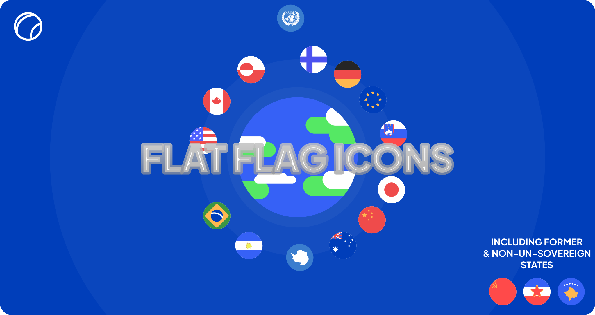

# InteraApps Flag Icons
In this Repository you can find minimalistic flatdesign icons for your awesome projects. These are always in an 1x1 format and 150x150 SVG.

# States
The `states` folder contains sovereign & non-sovereign states (Currently not everyone) by their ISO-3166-2 Code (`/states/DE.svg`)

# Former
The `former-states` folder contains some flags of former states like the USSR or Yugoslavia.

## Sovietunions SSR Flags
The `former-states/SSR` folder contains the flags of the soviet republics in the format su-`Todays ISO3166-2 code`. For example `former-states/SU-UA.svg` (For the Ukranian SSR)

## Regions
The `regions` folder contains some flags of provinces and cities.